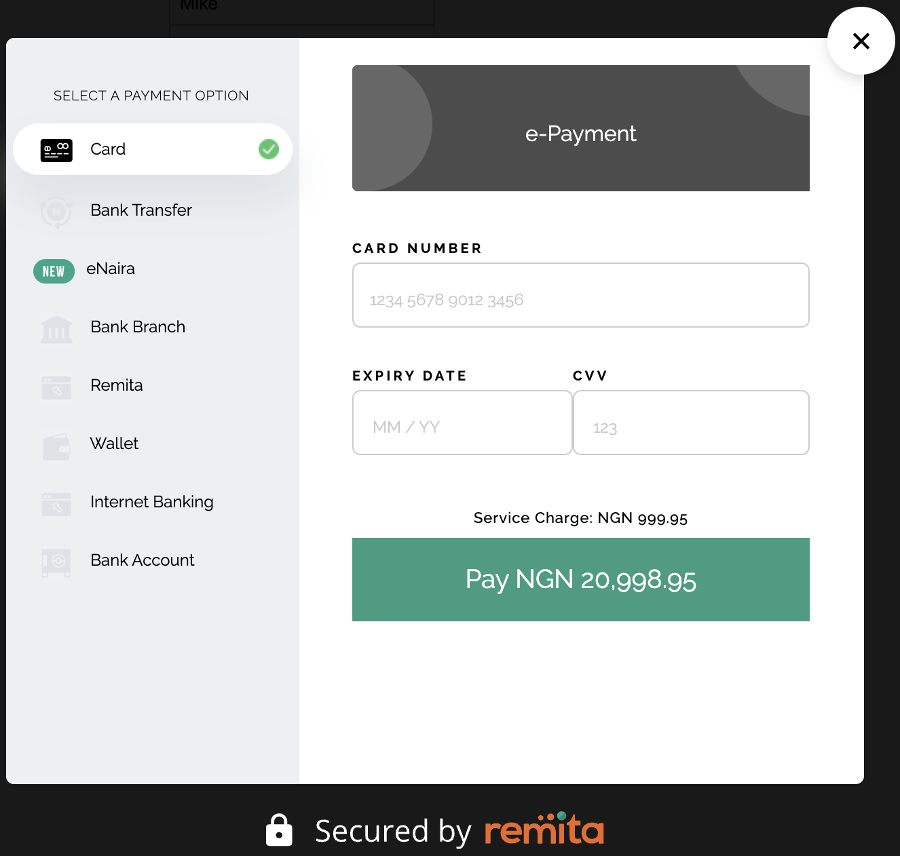

# Remita Inline Sample rrr

> Our Web library lets you easily accept payments inside any web application.



## Usage

To start using Remita Inline Checkout, refer to the [index HTML file](index.html.html)

Please replace the 'public key' in the script with your assigned API key, which you can obtain by signing up as an integrator on [remita](https://remita.net).

## Development setup

Integrating Remita Inline Checkout is a straightforward process. Include our JavaScript library at the bottom of the checkout form page, like so:

```sh
<form onsubmit="makePayment()" id="payment-form">
            <div class="form-floating mb-3 mt-3">
               <input type="text" class="form-control" id="js-rrr" name="rrr" placeholder="Enter RRR"/>
               <label for="rrr">Enter RRR</label>
            </div>
            <p><strong>Note:</strong> To generate an RRR to use on this page,</p>
            <ul>
               <li><a href= "https://api.remita.net/#ed5722a2-4bf3-40a0-99c5-37f94cb94a55" target="_blank">Click here</a> to utilize our Invoice Generation API, or</li>
               <li><a href= "https://demo.remita.net/remita/onepage/QATEST/biller.spa" target="_blank">Click here</a> to generate a Bill and go to the 'Bank Branch' Payment option to get the RRR</li>
            </ul>
            <input type="button" onclick="makePayment()" value="Submit" button class="button"/>
         </form>
      </div>
      <script type="text/javascript" src="https://demo.remita.net/payment/v1/remita-pay-inline.bundle.js"></script>
<script>
   function makePayment() {
  var form = document.querySelector("#payment-form");
  var paymentEngine = RmPaymentEngine.init({
  key:"QzAwMDAyNzEyNTl8MTEwNjE4NjF8OWZjOWYwNmMyZDk3MDRhYWM3YThiOThlNTNjZTE3ZjYxOTY5NDdmZWE1YzU3NDc0ZjE2ZDZjNTg1YWYxNWY3NWM4ZjMzNzZhNjNhZWZlOWQwNmJhNTFkMjIxYTRiMjYzZDkzNGQ3NTUxNDIxYWNlOGY4ZWEyODY3ZjlhNGUwYTY=",
  processRrr: true,
  transactionId: Math.floor(Math.random()*1101233), // Replace with a reference you generated or remove the entire field for us to auto-generate a reference for you. Note that you will be able to check the status of this transaction using this transaction Id
extendedData: {
    customFields: [
       {
          name: "rrr",
          value: form.querySelector('input[name="rrr"]').value
       }
     ]
  },
    onSuccess: function (response) {
        console.log('callback Successful Response', response);
		const xhr = new XMLHttpRequest();
		xhr.open("GET", "https://remita.net/");
		xhr.send();
    },
    onError: function (response) {
        console.log('callback Error Response', response);
    },
    onClose: function () {
        console.log("closed");
    }
  });
 paymentEngine.showPaymentWidget();
  }
  window.onload = function () {
  setDemoData();
  };
</script>

```

## Documentation

For detailed information, refer to [Remita Documentation](https://remita.net/developers/)

## Release History

- 0.1.1
  - CHANGE: Updated documentation
- 0.1.0
  - Initial release
- 0.0.1
  - Work in progress

## Useful links

- Join our Slack Developer/Support channel at [slack](http://bit.ly/RemitaDevSlack)

## Support

- For all other support needs, support@remita.net

###Contributing: To contribute to this repository, follow the steps below:

- Fork the repository
- Create a new branch: `git checkout -b feature-name`
- Make changes and commit: `git commit -m "added some new features"`
- Make pushes: `git push origin feature-name`
- Submit a PR (Pull Request)
